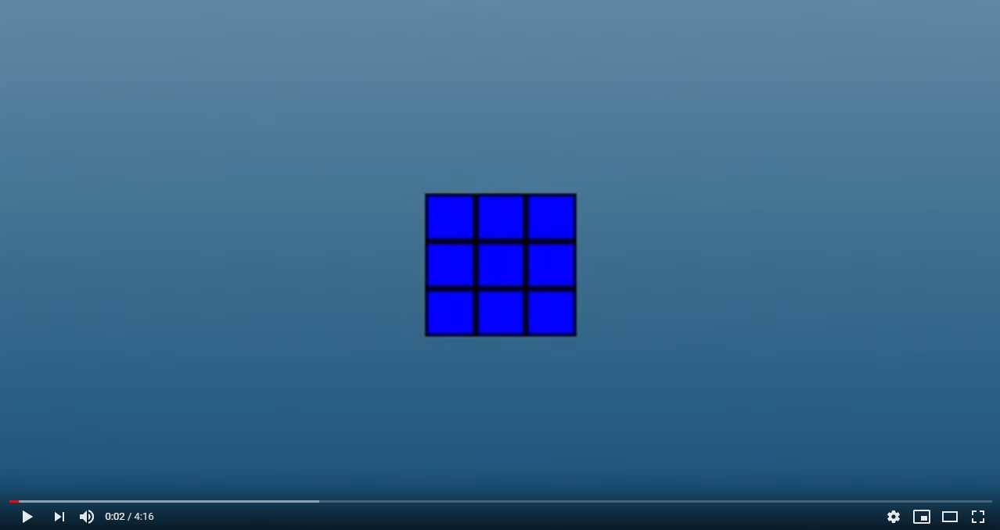

# Rubiks Cube
Simulator of Rubik's Cube made in C++ and modern OpenGL. All rotation are described in accordance with the official notation found [here](https://ruwix.com/the-rubiks-cube/notation/).

Watch demo

## Controlls
To rotate Front, Back, Up, Down, Left or Right face clockwise press respectively F, B, U, D, L or R key. 
For counter counter-clockwise rotation simply hold shift when rotating face.

You can move camera by holding left mouse botton or by direction keys on numpad 
alternatively camera can be set to look directly at cube's Front, Right or Up face by pressing 1, 3 or 7 on numpad.

To change cube's orientation simply press X, Y oraz Z to rotate around corresponding axis.

## HOW TO BUILD
    git clone https://github.com/Yossari4n/SolarSystem.git
    cd RubiksCube
    mkdir build && cd build
    conan install ..
    cmake .. -G

To properly load resources and shaders source code make sure you have your executable path set up correctly - preferably pointing to the root of a project. Or copy 'resources' and 'src/shaders' directories to your build target directory.
